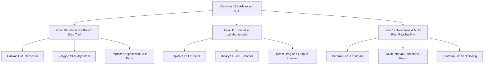

# 🗺️ Master Plan Pengembangan Geovara (Fase 10–12: Advanced Industry GIS)

> **Versi:** 3.0  
> **Tanggal Penyusunan:** 16 Agustus 2026  
> **Fokus Utama:** Implementasi perkakas mutakhir standar industri GIS desktop: pemotong poligon interaktif (*Interactive Knife / Slice Tool*), parser format ESRI Shapefile client-side (*.zip/.shp/.dbf*), dan analisis jangkauan wilayah / cincin aksesibilitas (*Isochrone & Multi-Ring Reachability Buffer*).

---

## 🎯 1. Ringkasan Ruang Lingkup



---

## 📋 2. Rincian Tiap Fase

### 🔹 Fase 10: Interactive Polygon Split & Slice (Knife Tool)
- [x] **10.1 Algoritma Pembagi Poligon (`src/lib/spatial-operations.ts`)**
  - [x] Implementasi `splitPolygonByLine`: Memotong geometri poligon menggunakan perpotongan garis (*line crossing*) dan merekonstruksi menjadi 2 poligon terpisah yang valid.
- [x] **10.2 Toolbar & State Machine Menggambar (`src/components/DrawingTools.tsx`)**
  - [x] Menambahkan mode `Slice` / `Knife` (ikon gunting) pada toolbar gambar.
  - [x] Menggambar garis yang membelah poligon aktif akan otomatis menggantikan poligon lama dengan 2 bagian poligon baru.
- [x] **10.3 Floating Guide & Dev API**
  - [x] Panduan kursor kustom: *"Tarik garis melintasi poligon untuk memotongnya"*.
  - [x] Ekspos fungsi ke `window.geovara.spatial.split(polygon, line)`.

---

### 🔹 Fase 11: Client-Side ESRI Shapefile Importer (`.zip`, `.shp`, `.dbf`)
- [x] **11.1 Binary Shapefile Parser (`src/lib/shapefile-parser.ts`)**
  - [x] Dekompresi arsip `.zip` menggunakan `jszip` langsung di memori browser (0 server payload).
  - [x] Parsing record biner ESRI Shapefile (`.shp`) untuk `Point`, `PolyLine`, `Polygon` dan atribut dBase (`.dbf`).
  - [x] Mengembalikan GeoJSON `FeatureCollection` standar RFC 7946.
- [x] **11.2 Drag-and-Drop & Import Integration (`src/components/FileDropZone.tsx`)**
  - [x] Deteksi otomatis file berakhiran `.zip` atau `.shp` saat di-drag ke peta atau dipilih melalui tombol unggah.
- [x] **11.3 Unit Test Suite (`tests/lib/shapefile-parser.test.ts`)**
  - [x] Verifikasi parsing format biner dan rekonsiliasi atribut baris (3/3 tests passed).

---

### 🔹 Fase 12: Isochrone & Travel-Time / Multi-Ring Reachability Analysis
- [x] **12.1 Multi-Ring Geodesic Buffer Engine (`src/lib/spatial-operations.ts`)**
  - [x] Fungsi `generateMultiRingBuffer(centerPoint, distances, units)` yang menghasilkan cincin konsentris bertingkat dengan warna gradien (*heat spectrum*).
- [x] **12.2 Dialog Analisis Spasial (`src/components/SpatialToolsDialog.tsx`)**
  - [x] Penambahan Tab **Reachability / Rings** dengan opsi konfigurasi interval (misal: `100, 300, 500` meter atau `1, 3, 5` km).
- [x] **12.3 Dokumentasi & User Guide (`src/components/HelpContent.tsx`)**
  - [x] Pembaruan panduan pengguna untuk fitur Knife Tool, Shapefile Importer, dan Multi-Ring Reachability.

---

## 🏗️ 3. Struktur File Terkait

```
src/
 ├── lib/
 │    ├── spatial-operations.ts        <-- [MODIFIED] splitPolygonByLine & generateMultiRingBuffer
 │    ├── shapefile-parser.ts          <-- [CREATED] Parser binary client-side Shapefile + JSZip
 │    └── dev-api.ts                   <-- [MODIFIED] Ekspos split & rings ke window.geovara.spatial
 ├── components/
 │    ├── DrawingTools.tsx             <-- [MODIFIED] Tambah mode 'Slice' (Knife tool)
 │    ├── SpatialToolsDialog.tsx       <-- [MODIFIED] Tambah Tab 'Rings'
 │    ├── FileDropZone.tsx             <-- [MODIFIED] Integrasi drag-and-drop .zip & .shp
 │    ├── CursorGuide.tsx              <-- [MODIFIED] Tambah petunjuk gestur untuk mode Slice
 │    └── HelpContent.tsx              <-- [MODIFIED] Dokumentasi fitur baru
tests/
 ├── lib/
 │    ├── spatial-operations.test.ts   <-- [MODIFIED] Unit tests untuk splitPolygonByLine & multi-rings
 │    └── shapefile-parser.test.ts     <-- [CREATED] Unit tests untuk parser Shapefile
```
