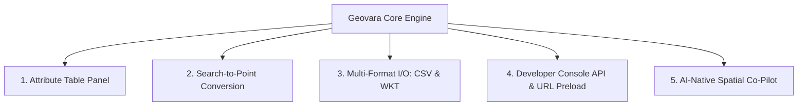

# 🚀 Master Plan & TODO Pengembangan Platform Geovara

> **Status Dokumen:** 15 Agustus 2026  
> **Referensi Utama:** [docs/geojson-io-riset-mendalam.md](file:///c:/Users/dev%20perusahaan%20pst/workspaces/mikeu-dev/geovara/docs/geojson-io-riset-mendalam.md)  
> **Fokus:** Transformasi Geovara menjadi Enterprise-Grade Web GIS & Spatial Editor dengan keunggulan AI-Native Co-Pilot.

---

## 🎯 Visi & Posisi Produk

Geovara memadukan keandalan **OpenLayers 9.2**, kecepatan komputasi spasial **Turf.js**, fleksibilitas 3D **Cesium**, dan kecerdasan **Google Gemini 2.0 Flash (Genkit)**. Menghasilkan platform editing geospasial modern yang bebas dependensi token komersial (seperti Mapbox) dan stateless dengan kompresi LZW URL.



---

## 📋 TODO & Roadmap Pengembangan

### 🔹 Fase 1: Manajemen Atribut & Search-to-Point (Prioritas Utama)

- [x] **1.1 Attribute Table Panel (Tab Tabel Spreadsheet)**
  - [x] Tambahkan tab `Table` pada [Sidebar.tsx](file:///c:/Users/dev%20perusahaan%20pst/workspaces/mikeu-dev/geovara/src/components/Sidebar.tsx).
  - [x] Buat komponen `AttributeTable.tsx` berbasis Radix UI / Shadcn Table.
  - [x] Fitur edit cell atribut secara inline.
  - [x] Fitur tambah kolom properti baru (*Add Column / Field*).
  - [x] Fitur hapus kolom properti.
  - [x] Fitur filter dan sorting data berdasarkan atribut.
  - [x] Sinkronisasi dua arah (*Two-way data binding*) antara Table, Monaco Editor, dan OpenLayers Map.

- [x] **1.2 Search Result → Add to Map as Point**
  - [x] Modifikasi [LocationSearch.tsx](file:///c:/Users/dev%20perusahaan%20pst/workspaces/mikeu-dev/geovara/src/components/LocationSearch.tsx) untuk menambahkan tombol aksi ganda:
    - 🔍 **Fly To**: Navigasi kamera ke lokasi (fitur saat ini).
    - ➕ **Add as Point**: Langsung mengonversi koordinat hasil pencarian menjadi GeoJSON `Point` feature di peta dengan atribut `display_name`, `place_id`, dan `osm_type`.
  - [x] Unit testing dan verifikasi integrasi alur penambahan Point hasil pencarian.

---

### 🔹 Fase 2: Perluasan Format Data (CSV, WKT, Shapefile)

- [x] **2.1 Import & Export CSV (Latitude / Longitude)**
  - [x] Buat parser helper di `src/lib/csv-geojson.ts`:
    - Auto-detect header koordinat (`lat`, `latitude`, `y`, `lon`, `lng`, `longitude`, `x`).
    - Parse baris CSV menjadi GeoJSON FeatureCollection (Point).
  - [x] Integrasikan drag-and-drop file `.csv` pada [FileDropZone.tsx](file:///c:/Users/dev%20perusahaan%20pst/workspaces/mikeu-dev/geovara/src/components/FileDropZone.tsx).
  - [x] Tambahkan opsi *Save as CSV* pada menu download di Sidebar.
  - [x] Unit tests di `tests/lib/csv-geojson.test.ts`.

- [x] **2.2 Import & Export WKT (Well-Known Text)**
  - [x] Buat parser helper di `src/lib/wkt-geojson.ts` untuk konversi dua arah WKT ↔ GeoJSON (`POLYGON`, `LINESTRING`, `POINT`, `MULTIPOLYGON`).
  - [x] Tambahkan opsi *Save as WKT* pada menu Save File.
  - [x] Unit tests di `tests/lib/wkt-geojson.test.ts`.

---

### 🔹 Fase 3: Developer Experience & Web API Debugging

- [x] **3.1 Remote Public GeoJSON Loader (`?url=https://...`)**
  - [x] Tambahkan query parameter parser di `src/lib/url-state.ts` untuk menangani `?url=https://example.com/data.geojson` dan format `#data=data:text/x-url,...`.
  - [x] Otomatis fetch data dengan status loading, validasi CORS, dan pemuatan ke map saat halaman dimuat.
  - [x] Menampilkan pesan error ramah jika URL eksternal memicu CORS / invalid format.

- [x] **3.2 Browser Console API (`window.geovara`)**
  - [x] Ekspos objek global `window.geovara` di client:
    ```typescript
    window.geovara = {
      map: Map,
      getGeoJSON: () => string,
      setGeoJSON: (geojson: object | string) => void,
      addFeature: (geometry: object, properties?: object) => void,
      clear: () => void,
      fitBounds: () => void,
      setBasemap: (id: string) => void,
      setProjection: (crs: string) => void,
    };
    ```
  - [x] Sediakan panduan cepat penggunaan Console API di Tab Help.

---

### 🔹 Fase 4: AI-Native Spatial Co-Pilot Enhancements

- [x] **4.1 Perintah Bahasa Alami untuk Format & Properti**
  - [x] *"Export all features to CSV"* (ekspor instan ke format `.csv`).
  - [x] *"Save as WKT"* (ekspor instan ke format Well-Known Text).
  - [x] *"Set property category to 'High Priority' for selected feature"* (manipulasi atribut fitur).
  - [x] *"Load remote GeoJSON from https://..."* (fetch dan visualisasi dataset eksternal).
- [x] **4.2 In-Memory Semantic Context & 0ms Fast Pattern Matcher**
  - [x] Fast client-side regex matcher untuk format download & URL loading (0ms latency, hemat kuota).
  - [x] Ringkasan schema properties pada feature context AI prompt.

---

## 🏗️ Struktur Rencana File Baru

```
src/
 ├── components/
 │    ├── AttributeTable.tsx        <-- [NEW] Panel tabel atribut
 │    ├── LocationSearch.tsx        <-- [MODIFY] Tambah opsi 'Add as Point'
 │    ├── Sidebar.tsx               <-- [MODIFY] Tab Table & menu export baru
 │    └── FileDropZone.tsx          <-- [MODIFY] Dukungan drag-and-drop CSV
 ├── lib/
 │    ├── csv-geojson.ts            <-- [NEW] Parser & generator CSV
 │    ├── wkt-geojson.ts            <-- [NEW] Parser & generator WKT
 │    ├── url-state.ts              <-- [MODIFY] Dukungan ?url= query param
 │    └── dev-api.ts                <-- [NEW] Inisialisasi window.geovara API
tests/
 ├── lib/
 │    ├── csv-geojson.test.ts       <-- [NEW] Unit tests CSV
 │    ├── wkt-geojson.test.ts       <-- [NEW] Unit tests WKT
 │    └── dev-api.test.ts           <-- [NEW] Unit tests Console API
```

---

## 📈 Kriteria Sukses (Success Metrics)
1. **Zero Regression**: 100% test passing (`vitest run`, `playwright test`, `tsc --noEmit`).
2. **Performance**: Render data >1000 baris di Attribute Table tetap mulus tanpa stutter.
3. **Stateless Compatibility**: Semua fitur baru tetap kompatibel dengan kompresi URL LZW dan offline state.
