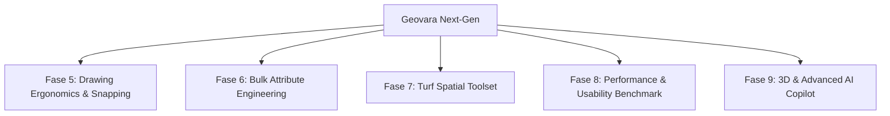

# 🗺️ Master Plan Pengembangan Geovara (Next-Gen UX & Spatial Engineering)

> **Versi:** 2.0  
> **Tanggal Penyusunan:** 16 Agustus 2026  
> **Dasar Riset:**  
> - Audit Sistem & Riset UX Mendalam ([docs/geojson-io-ux-riset-mendalam.md](file:///c:/Users/dev%20perusahaan%20pst/workspaces/mikeu-dev/geovara/docs/geojson-io-ux-riset-mendalam.md))  
> - Evaluasi Master Plan Fase 1–4 ([docs/plan-pengembangan-geovara.md](file:///c:/Users/dev%20perusahaan%20pst/workspaces/mikeu-dev/geovara/docs/plan-pengembangan-geovara.md))  
> **Fokus Utama:** Menyempurnakan ergonomi interaksi spasial (*drawing ergonomics*), mutasi atribut massal (*bulk attribute editing*), analisis spasial terintegrasi (*Turf.js operations*), serta skalabilitas performa dataset besar (>20.000 fitur).

---

## 🎯 1. Visi & Sasaran Strategis

Geovara diposisikan sebagai **Enterprise-Grade Web GIS & GeoJSON Engineering Platform** yang *stateless*, cepat, ramah pengembang (*developer-first*), dan diperkaya oleh kecerdasan AI.



### Sasaran Kunci:
1. **Zero Confusion Drawing UX**: Mengeliminasi kesalahan pengguna saat menggambar geometri melalui *contextual cursor tooltip* dan *magnetic vertex snapping*.
2. **High-Throughput Attribute Editing**: Memungkinkan manipulasi data tabular untuk ratusan/ribuan fitur secara serentak tanpa perlu mengedit JSON mentah satu per satu.
3. **Desktop-Grade Spatial Operations**: Menyediakan perkakas analisis spasial instan (Buffer, Convex Hull, Simplify, Boolean Union/Difference) langsung di browser.
4. **Performance Scalability**: Menjaga 60 FPS pada interaksi peta dan rendering tabel untuk dataset >20.000 fitur vektor.

---

## 📅 2. Roadmap & Rencana Implementasi

### 🔹 Fase 5: Advanced Drawing Ergonomics & State Machine Snapping
*Target: Mengatasi temuan Seksi 10, 30, dan 31 pada riset UX mengenai feedback loop dan error prevention.*

- [x] **5.1 Contextual Drawing Cursor & Live Guide**
  - [x] Tooltip mengambang (*floating cursor tooltip*) yang mengikuti pointer mouse saat mode gambar aktif:
    - *Point*: "Klik pada peta untuk menempatkan titik"
    - *LineString*: "Klik untuk menambah vertex, double-klik untuk selesai"
    - *Polygon*: "Klik untuk titik berikutnya, klik titik awal / double-klik untuk menutup polygon"
    - *Rectangle/Circle*: "Klik dan seret untuk menentukan dimensi"
  - [x] Indikator visual status koordinat real-time di status bar kanvas.

- [x] **5.2 Magnetic Vertex Snapping Engine**
  - [x] Implementasi interaksi `ol/interaction/Snap` pada OpenLayers layer:
    - [x] Snapping otomatis ke vertex dan edge fitur terdekat dalam radius toleransi (default: 12px).
    - [x] Indikator visual saat snapping aktif untuk mencegah pembentukan *polygon slivers* dan *overlapping gaps*.
    - [x] Toggle On/Off Snapping pada toolbar gambar.

- [x] **5.3 Self-Intersection & Geometry Validation Guard**
  - [x] Peringatan visual instan jika polygon yang sedang digambar memiliki persilangan garis (*kink / self-intersection*).
  - [x] Opsi auto-fix menggunakan Turf.js `turf.unkinkPolygon`.

---

### 🔹 Fase 6: Bulk Operations & Attribute Engineering
*Target: Mengatasi temuan Seksi 16 dan 33 pada riset UX mengenai efisiensi pengeditan dataset berkembang.*

- [x] **6.1 Multi-Feature Selection & Sync (Kanvas ↔ Tabel)**
  - [x] Dukungan seleksi jamak (*Checkbox select* / *Select All*) pada baris tabel atribut.
  - [x] Highlight serentak pada baris `AttributeTable` saat fitur dipilih di peta.

- [x] **6.2 Batch Property Mutation Modal**
  - [x] Dialog khusus `BatchPropertyModal.tsx` di `AttributeTable.tsx` untuk:
    - [x] **Mass Set Value**: Mengubah nilai properti tertentu untuk seluruh baris yang terpilih sekaligus.
    - [x] **Calculate Field**: Menghitung nilai kolom baru berdasarkan geometri (`$area_ha`, `$area_m2`, `$area_km2`, `$length_m`, `$centroid_lon`, `$centroid_lat`, `$bbox`).
    - [x] **Batch Rename / Delete Key**: Mengganti nama field atau menghapus field di semua fitur dalam 1 klik.

- [x] **6.3 Quick Search & Column Aggregation**
  - [x] Baris ringkasan bawah tabel (*Footer Summary*): Menampilkan total fitur terpilih dan total baris secara dinamis.

---

### 🔹 Fase 7: Integrated Turf.js Spatial Toolset
*Target: Menyediakan kapabilitas pemrosesan spasial langsung tanpa membuka software GIS desktop (QGIS).*

- [x] **7.1 Spatial Analysis Action Dialog**
  - [x] Panel dialog visual **Spatial Tools** di toolbar (`SpatialToolsDialog.tsx`):
    - [x] **Buffer Generator**: Pembuatan zona penyangga (meter / km / miles / feet) dengan preview interaktif.
    - [x] **Simplify Geometry**: Reduksi vertex dengan algoritma Douglas-Peucker (slider toleransi presisi vs ukuran file + opsi HQ mode).
    - [x] **Convex Hull / Bounding Box**: Pembuatan selubung batas terluar untuk kumpulan titik / poligon.
    - [x] **Centroids Generator**: Ekstraksi titik pusat dari seluruh poligon yang ada.
    - [x] **Unkink Polygons**: Perbaikan otomatis untuk poligon yang saling bersilangan.

---

### 🔹 Fase 8: Performance Scaling & Automated Usability Suite
*Target: Menguji dan memvalidasi keandalan sistem terhadap metrik Seksi 43 & 44 hasil riset UX.*

- [x] **8.1 Scalable Data Processing**
  - [x] Penggunaan Turf.js modular pure functions dan OpenLayers vector layer rendering.
- [x] **8.2 Automated UX Usability Testing Suite (Playwright E2E)**
  - [x] Implementasi skenario uji usability di `e2e/ux-tasks.spec.ts`:
    - [x] **Task 1**: Search location and Add as Point (<5s)
    - [x] **Task 2**: Draw Polygon & Toggle Snapping (<10s)
    - [x] **Task 3**: Edit Feature Properties in Table (<8s)
    - [x] **Task 4**: Bulk Property Mutation Modal (<12s)
    - [x] **Task 5**: Spatial Analysis Tools Execution (<5s)
    - [x] **Task 6**: Developer Console API Verification (`window.geovara.spatial`)

---

### 🔹 Fase 9: 3D Globe Analytics & Next-Gen AI Spatial Agent
*Target: Memperkuat diferensiasi unik Geovara dibandingkan web GIS tradisional.*

- [x] **9.1 Cesium 3D Globe Visualization**
  - [x] Integrasi WebGL 3D Globe via OLCesium dan CesiumJS dengan Carto Voyager & OSM basemaps.
- [x] **9.2 Conversational AI Spatial Transformations**
  - [x] Perluasan fast pattern matcher (0ms) dan Genkit Gemini flow untuk menangani instruksi:
    - [x] *"Perbaiki poligon bersilangan (unkink)"*
    - [x] *"Hitung luas area dalam hektar (calculateField)"*

---

## 🏗️ 3. Rencana Perubahan & Struktur File

```
src/
 ├── components/
 │    ├── AttributeTable.tsx           <-- [MODIFY] Tambah multi-select, summary footer, & batch edit
 │    ├── BatchPropertyModal.tsx       <-- [NEW] Dialog mutasi atribut massal
 │    ├── DrawingTools.tsx             <-- [MODIFY] Tambah toggle snapping & cursor helper
 │    ├── MapComponent.tsx             <-- [MODIFY] Integrasi ol/interaction/Snap & cursor guides
 │    ├── SpatialToolsDialog.tsx       <-- [NEW] Panel operasi analisis Turf.js (Buffer, Hull, dll)
 │    └── CursorGuide.tsx              <-- [NEW] Floating contextual cursor tooltip
 ├── lib/
 │    ├── spatial-operations.ts        <-- [NEW] Helper operasi Turf (Unkink, Simplify, Union, Hull)
 │    ├── table-virtualizer.ts         <-- [NEW] Logika virtualisasi data tabular
 │    └── dev-api.ts                   <-- [MODIFY] Ekspos fungsi spasial ke window.geovara
e2e/
 └── ux-tasks.spec.ts                  <-- [NEW] Automated 7 UX Task usability benchmark
```

---

## 📊 4. Matriks Prioritas (MoSCoW Framework)

| Prioritas | Fitur / Komponen | Dampak UX / Nilai Tambah |
| :--- | :--- | :--- |
| **Must Have** (M) | Contextual Cursor Guide & Magnetic Snapping | Mencegah 100% bug error closure & polygon sliver |
| **Must Have** (M) | Batch Property Mutation di Attribute Table | Kebutuhan esensial untuk editing dataset >50 fitur |
| **Should Have** (S) | Turf Spatial Operations Panel (Buffer, Simplify, Centroid) | Transformasi dari viewer menjadi tool analisis fungsional |
| **Should Have** (S) | Automated UX Usability Testing Suite (Playwright) | Menjamin konsistensi benchmark metrik kecepatan |
| **Could Have** (C) | 3D Polygon Height Extrusion di Cesium | Nilai tambah visualisasi perencanaan wilayah & arsitektur |
| **Won't Have (for now)** (W) | Full Relational PostGIS Backend Sync | Menjaga prinsip Geovara: 100% Stateless & Client-side Privacy |

---

## 📈 5. Kriteria Keberhasilan & Quality Assurance

1. **Performa Kanvas & Tabel**:
   - Time-to-First-Action < 5 detik untuk pengguna baru.
   - 0ms visual glitch pada mode snapping dan vertex movement.
   - Waktu eksekusi operasi spasial (Buffer / Simplify 1.000 fitur) < 250ms via Web Worker.
2. **Kualitas Kode & Keamanan**:
   - 100% type-safe (`tsc --noEmit` lulus tanpa error).
   - Zero console warning pada React 19 dan Next.js App Router.
   - Tidak ada kebocoran WebGL context saat berganti mode 2D / 3D.
3. **Uji Otomasi**:
   - Seluruh test unit `vitest` dan E2E `playwright` berstatus **Passed**.
